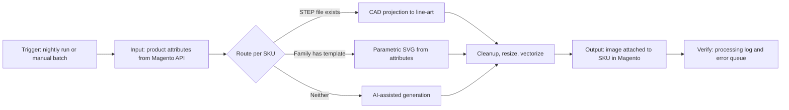

# Workflow

```mermaid
graph LR
    A[Trigger: nightly run or manual batch] --> B[Input: product attributes from Magento API]
    B --> C{Route per SKU}
    C -->|STEP file exists| D[CAD projection to line-art]
    C -->|Family has template| E[Parametric SVG from attributes]
    C -->|Neither| F[AI-assisted generation]
    D --> G[Cleanup, resize, vectorize]
    E --> G
    F --> G
    G --> H[Output: image attached to SKU in Magento]
    H --> I[Verify: processing log and error queue]
```
